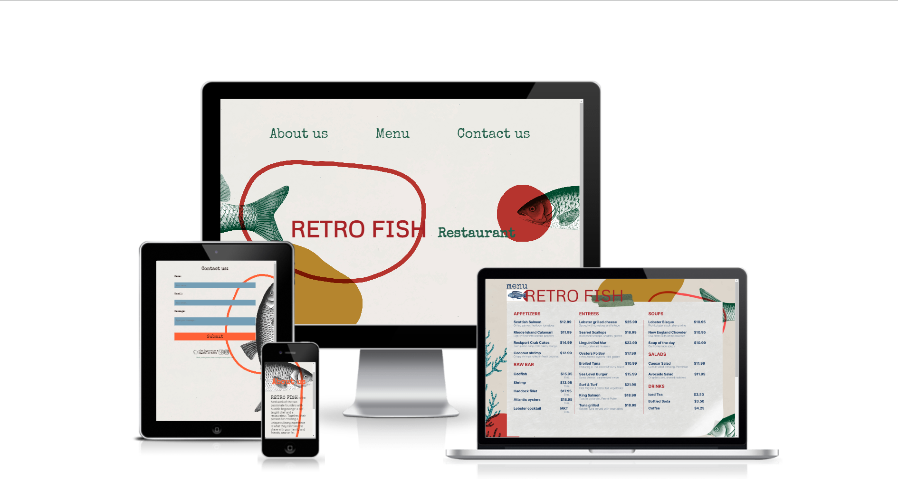
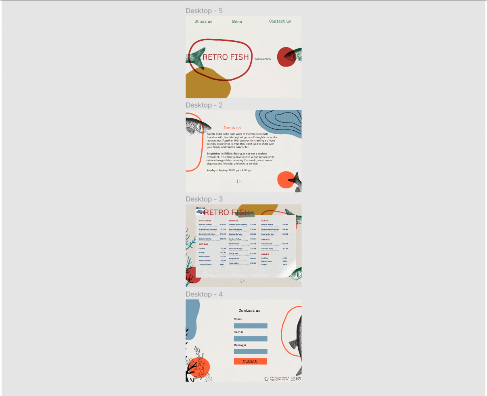

<h1><em><a href="https://retro-fish.netlify.app" target="_blank">Retro Fish Website</a><em></h1>
    

  <h3>Features:</h3>
  
Figma project

  
    <ul>
      <li>Responsive, on all devices</li>
   </ul>

  <h3>Technologies Used</h3>
   <ul>
      <li><a href="https://www.w3schools.com/html/" target="_blank">HTML</a></li>
      <li><a href="https://www.w3schools.com/css/" target="_blank">CSS</a></li>
      <li><a href="https://greensock.com/gsap/" target="_blank">GSAP</a></li>
      <li><a href="https://www.figma.com/" target="_blank">FIGMA</a></li>
   </ul>

  <h3>Website Demo</h3>

https://user-images.githubusercontent.com/95896159/209396986-b4e1d0be-81e3-41be-819a-f42b86e318dd.mp4

